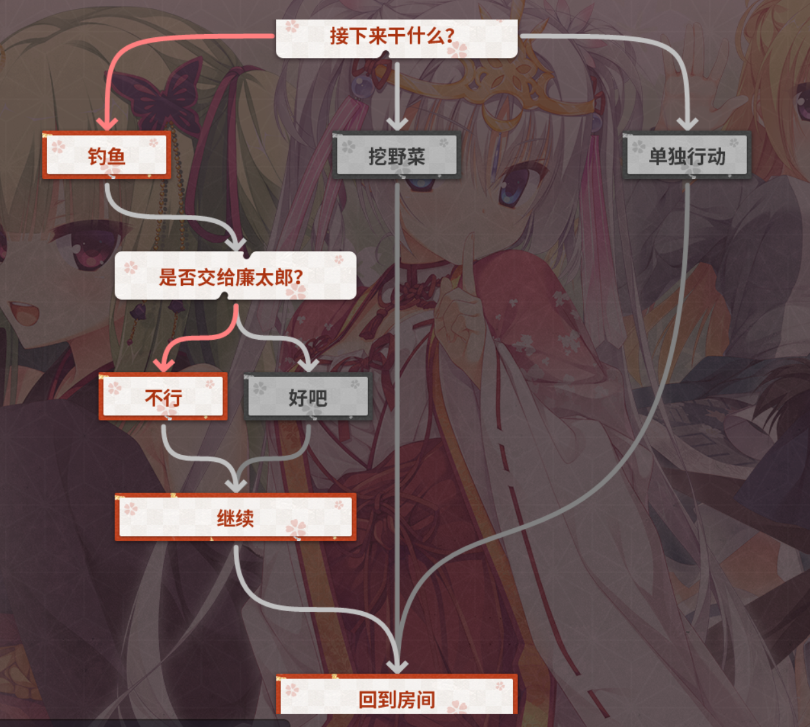

# 《千恋＊万花》解包记录


## 备注

游戏解包属于侵权行为。本次解包仅作为学习交流，以学习及展示部分工具的使用方法。

## 环境

`python 3.8.18`

**requirements**

```python
colorama==0.4.6
contourpy==1.1.1
cycler==0.12.1
fonttools==4.47.0
importlib-resources==6.1.1
kiwisolver==1.4.5
matplotlib==3.7.4
numpy==1.24.4
opencv-python==4.9.0.80
packaging==23.2
pillow==10.2.0
pyparsing==3.1.1
python-dateutil==2.8.2
six==1.16.0
tqdm==4.66.1
zipp==3.17.0
```

## 使用的工具

* [`KrkrExtract`](https://github.com/xmoezzz/KrkrExtract) 解包游戏文件
* [`expimg`](http://asmodean.reverse.net/pages/expimg.html) 解包pimg
* [`FreeMoteToolkit`](https://github.com/UlyssesWu/FreeMote) 解包.scn台词文件
* [`tlg2png`](https://github.com/vn-tools/tlg2png) 转换tlg文件为png文件
* `PILLOW, opencv` 拼接CG

## 流程

### 使用KrkrExtract解包游戏文件

将游戏文件`SenrenBanka.exe`拖拽至`KrkrExtract.exe`，随后按照UI进行设置解包。

### 关于音频

音频解包出来为`ogg`格式文件，可直接播放。BGM可在音乐平台上查到，这里不进行解包。

### 对场景CG进行解包

《千恋＊万花》场景CG（evimage）打包为`.pimg`格式文件。使用`expimg`将其解包为对应`.tlg`格式文件，再将`.tlg`格式文件用`tlg2png`转换为`.png`格式文件。

`expimg.exe`使用方法：

```bash
expimg.exe [source]
```

示例：源文件`ev101a.pimg`
```bash
expimg.exe ev101a.pimg
```

tlg文件会输出在源文件所在文件夹下。

`tlg2png.exe`使用方法：

```bash
tlg2png.exe [source] [target]
```

示例：源文件`芳乃a_0_1855.tlg`
```bash
tlg2png.exe 芳乃a_0_1855.tlg ./out.png
```

png文件会输出至`target`指定位置

对应代码`extract_CG.py`

#### 对场景CG进行整合

《千恋＊万花》场景CG存储方式为背景+对应表情差分。每一个场景CG附带一个txt文件说明图像信息。txt文件格式如下：

```
image_width: (int) # 背景图片宽
image_height: (int) # 背景图片高

name:         (string) # 差分名称
layer_id:     (int) # 差分id
width:        (int) # 差分宽
height:       (int) # 差分高
left:         (int) # 差分左上角位于背景图片x坐标
top:          (int) # 差分左上角位于背景图片y坐标
opacity:      (int) # 差分透明度
layer_type:   (int) # 层类型
type:         (int) # 差分类型
visible:      (int) # 是否可见

name:         (string) # 差分名称
layer_id:     (int) # 差分id
width:        (int) # 差分宽
height:       (int) # 差分高
left:         (int) # 差分左上角位于背景图片x坐标
top:          (int) # 差分左上角位于背景图片y坐标
opacity:      (int) # 差分透明度
layer_type:   (int) # 层类型
type:         (int) # 差分类型
visible:      (int) # 是否可见
...
```

对于一个场景以及其差分，命名规则为：Xx，其中X代表场景标号，x代表差分标号。例如：Aa, Ab, Ac, Ad，代表场景A的a, b, c, d四个差分；Da, Db, Dc代表场景D的a, b, c三个差分。

一般Xa差分为完整场景图片，其后b, c, d...差分为表情和动作差分。因此一般均为将Xb, Xc, Xd...差分按照对应(left, top)覆盖到Xa上。对应代码`merge_CG.py`。

### 对立绘CG解包

待补充

### 对台词进行解包

《千恋＊万花》台词文件打包为`.ks.scn`文件。使用`FreeMoteToolkit`中的`PsbDecompile.exe`转换为`.json`文件，然后再进行分析。

`PsbDecompile.exe`使用方法：

```bash
PsbDecompile.exe [source]
```

示例：`102・芳乃－告白ver1.03.ks.scn`
```bash
PsbDecompile.exe 102・芳乃－告白ver1.03.ks.scn
```

会生成两个`json`文件（`102・芳乃－告白ver1.03.ks.json`，`102・芳乃－告白ver1.03.ks.resx.json`），均输出在源文件所在文件夹下。其中文件名中有`.resx`的是输出信息文件，包含具体台词及其他设定的是文件名中不含`.resx`的文件。下面对这个文件进行解析。

#### 对解包得到的json台词文件进行解析

文件格式：

```json
{
    "hash": "",
    "name": "", // file name
    "outlines": [],
    "scenes":[
        {
            "label": "", // the label of the scene
            "nexts":[
                {
                    "storage": "", // target file name
                    "target": "", // target label
                    //...
                },
                {
                    "storage": "",
                    "target": "",
                    //...
                },
                //...
            ], // if current scene has more than one next scenes, then nexts length > 1
            ("selects": [
                {
                    "storage": "",
                    "tag": "",
                    "target": "",
                    "text": ""
                },
                {
                    "storage": "",
                    "tag": "",
                    "target": "",
                    "text": ""
                }
            ]), // if the scene is a selection
            ("texts": [
                ["character", "comment", "dialog", ...],
                ["character", "comment", "dialog", ...],
                //...
            ]), // if the scene has dialogs
            //...
        },
        //{...},
        //{...},
        //...
    ]
}
```

《千恋＊万花》台词存在于场景中，台词设置以及其他环境设置均存放于上述`scenes`字段中。不同的场景使用单向链表的形式串联起来，对于一个场景，其下一个场景的`label`存放于`nexts`字段中。

对于包含台词的场景，台词会存放于`texts`字段中，每一个台词是一个列表，其中前三项分别为`角色名、其他称呼、台词`。

对于包含选择项的场景，选择项会存放于`selects`字段中，每一个选择项是一个字典，`storage`字段表示选择项指向的目标所在文件，`target`字段表示选择项指向的目标label，`text`字段表示选择项的文本。

对于形如如下流程图的场景连接，程序中采用记录每一个节点的入度，然后使用深度优先搜索方法，访问到一个节点的时候，首先将其入度减一，然后判断入读是否为零。如果不为零，那么说明还有另外一条线通向当前节点，于是回溯到上一次分支位置，查看其他子节点；否则就递归访问其子节点。



对应代码`dialog_analyze.py`

## 参考资料

* [【技术】新人也能懂的galgame游戏解包方法](https://www.bilibili.com/read/cv6488276/)
* [慢慢整理一下用到的游戏相关工具](https://blog.csdn.net/Sayai/article/details/81386784)
* [KrkrExtract](https://github.com/xmoezzz/KrkrExtract)
* [expimg](http://asmodean.reverse.net/pages/expimg.html)
* [FreeMoteToolkit](https://github.com/UlyssesWu/FreeMote)
* [tlg2png](https://github.com/vn-tools/tlg2png)
